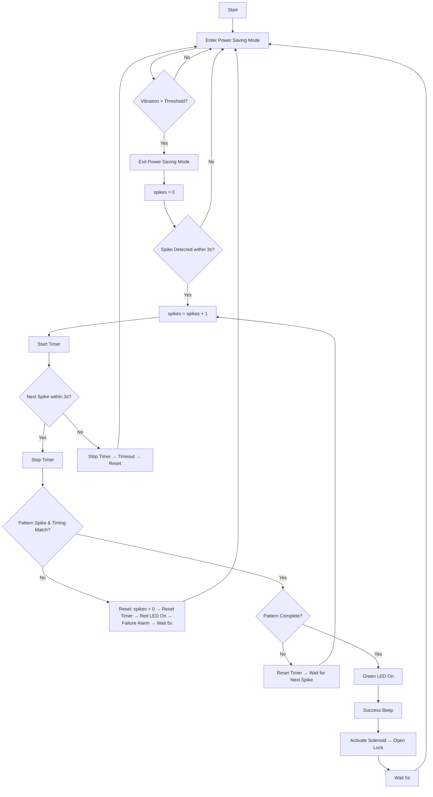

# The Knock Lock
## Problem Statement
As children, many of us might have created special codes that we knock on a door to identify ourselves to our friends or siblings. But, what if those special codes could actually unlock the door itself? 
Better yet, what if you could store your belongings in a safe box which could only be opened if you knock the correct code? 

There are many different types of safes and lock boxes on the market that use systems varying from combinations to NFC, but there are almost no products of this kind that unlocks by recognising a specific 
knocking pattern. As such, the aim of The Knock Lock project is to design and assemble a system that unlocks a lock box by recognizing a specific knocking pattern, perhaps with the hope of extending the idea to work on a full door.

## Requirements
To fully implement the system, a number of requirements related to function, technology and project management have been outlined. 

### Functional Requirements
For Knock Lock Box to be a satisfiable product, the following functional requirements must be implemented:

- It unlocks within 1-2 seconds when a specific knocking pattern is used on the surface of the box
- It turns a green LED on and simultaneously plays a simple beep to indicate that the box has been unlocked
- It rejects pattern if incorrect within 1-2 seconds after knocking has ended
- It turns a red LED on and simultaneously plays a simple alarm to indicate that the knocking pattern was false or unrecognized
- It alerts when the battery level drops below a certain level by flashing a red LED, even in power saving mode
- It only powers on after some initial knock to wake up the system, on wake it shows an yellow LED
- If no knocks detected for 30 seconds, it goes back to power saving mode
- It has provision to use a c port as an alternative power source in case battery dies out, with no prospect to upload firmware through it
- It uses a solenoid to retract or repel the bolt for unlocking and locking respectively

Some further optional and advanced features include:

- It has a programming mode where the user sets the knock for the system to recognize, mode can only be entered when the box is unlocked (for example using NFC)
- It has an NFC to unlock the box in case of system failure
- It alerts user in case door is left unlocked for a long time using beep sound

### Technical Requirements
For the Knock Knock Lock Box to operate and perform its functions, the following technical requirements must be implemented:

- The piezo-disc sensor can detect at knock amplitudes and output a measurable voltage reading to the MCU
- There are bleed resistors and clamping diodes to protect the power supply and MCU from voltage spikes that might occur from the piezo-disc sensor
- The MCU Software can detect at most 10 knocks within a 3-5 second interval and match the amplitudes to the predefined knock pattern with a set tolerance of acceptance
- The power supply is a battery with a working voltage of 2V to 5.5V
- The enclosure can protect the system within a typical indoor environment (IP 31)
- An analogue comparator connected to the piezo to wake the MCU from low power mode
- Should function at temperatures ranging 0-40°C and humidity 10-90%

### Project Requirements
For the Knock Knock Lock Box project to produce a functional product upon close out, the following project requirements must be met:

- the budget is 25€ not including the PCB
- the project workload is estimated at 240h
- the project schedule adheres to the following deadlines
    - Schematic Design: 2025-10-26
    - PCB Design Draft: 2025-11-09
    - PCB Design and Partslist: 2025-11-23
    - PCB Assembly: 2025-12-20
    - Project Report and Presentation: 2026-01-11

## Design Concepts

A very preliminary sketch of the idea, for simplicity the wiring and ICs have been neglected.

## Methodology
The piezo electric sensor can detect knocks through a surface and create voltage spikes. These voltage spikes can be considered as a pattern, which can be repeated and compared by a microcontroller. 
When a user sets a specific pattern of timed spikes of certain amplitudes, this can be stored. 

Mainly the system, shall remain in power saving mode, with all peripherals off, only the piezo electric sensor on connected to a comparator. When a knock is detected (a certain threshold reached) the 
comparator triggers the system to come out of power saving mode and turns the yellow LED on, signaling the user to start the knocking. The user repeats the code, which the algorithm checks with the predefined pattern stored, naturally these can not be identical so with some tolerance it either matches or rejects the pattern and signaling the green or red LED respectively.

If the pattern had matched successfully the microcontroller uses the solenoid to pull the bolt and hence opening the door. If door is left open for too long (5s), the system goes back to power saving 
mode, but this time alerting user with a beep that door is unlocked, when naturally the door is closed, the piezo electric sensor triggers the comparator, and hence gets system in normal mode to close 
the door. After a few seconds of inactivity the system goes back into power saving mode.

### Flowchart
The following flowchart outlines the main logic for detecting a knock:

## Preliminary BOM
This is a preliminary parts list. It does not account for all passives (resistors and capacitors) or connectors (wires, solder, pin headers, etc.). Some components are also subject to 
change as design process proceeds. Additionally, any parts that can be found within the University stockpile will be used from there instead of purchased.  
| Qty | Part | Order ID | Vendor | Price [€] |
|-----|------|----------|--------|------------|
| 1   | Piezo contact Sensor | 497-P27040-1 | Mouser | 0.87 |
| 1   | Bleed Resistor (1 MΩ) | 603-RC0805FR-071MP | Mouser | 0.086 |
| 2   | Clamping Diodes | 621-1N4148WT | Mouser | 0.172 |
| 1   | ESP-32 | 356-ESP32C6MINI1H8 | Mouser | 4.69 |
| 1   | N-MOSFET (solenoid driver) | 726-2N7002DWH6327 | Mouser | 0.284 |
| 1   | Solenoid | 485-2776 | Mouser | 4.43 |
| 1   | RGB LED | 941-CMVWQ1B1CBCHBB7A | Mouser | 0.155 |
| 2   | Signal Resistor (1 kΩ) | 603-AF0603FR-071K24L | Mouser | 0.224 |
| 1   | Piezo Buzzer | 179-CPT-2212-3TH | Mouser | 0.79 |
| 1   | Voltage Regulator | 579-MCP1700-3302E/TO | Mouser | 0.43 |
| 2   | Decoupling Capacitors | 81-GRM155D70G475ME5J | Mouser | 0.344 |
| 1   | LiPo Battery | 485-5383 | Mouser | 2.54 |
| 1   | USB C Port (3A IPX7) | 737-USC20SRACS22ESM | Mouser | 1.31 |

Total Price = €17.28
Total Price with VAT = €20.56
